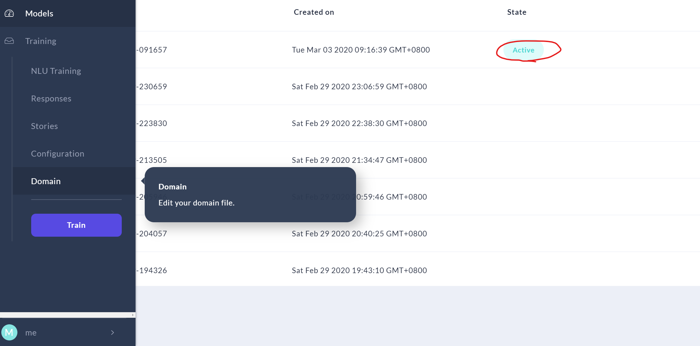

# README


# DEMO-GIF


# 说明

- 本项目基于最新版Rasa与Rasa x

- 会话管理使用的是rasa-core，rasa的pipeline配置如下：
      pipeline:
        - name: "MitieNLP"
          model: "data/total_word_feature_extractor_zh.dat"
        - name: "JiebaTokenizer"
          dictionary_path: "./jieba_userdict" 
        - name: "EntitySynonymMapper" 
        - name: "RegexFeaturizer"
        - name: "MitieFeaturizer"
        - name: "SklearnIntentClassifier"
  注意，这里的total_word_feature_extractor_zh.dat需要另外下载并放在/data目录下，建议去作者[GaoQ1](<https://github.com/GaoQ1>)处下载
  
- policy配置如下

  ```
  policies:
  - name: MemoizationPolicy
  - name: KerasPolicy
  - name: MappingPolicy
  - name: TwoStageFallbackPolicy
        nlu_threshold: 0.3
        core_threshold: 0.3
  ```

- 关于本项目的更多细节可参照[项目报告](https://github.com/SWYZZWH/nCov_rasa_chatbot/blob/master/%E9%A1%B9%E7%9B%AE%E6%8A%A5%E5%91%8A/%E9%A1%B9%E7%9B%AE%E6%8A%A5%E5%91%8A.pdf)


# 配置环境

1. 下载zip包或者git clone

2. 创建虚拟环境（python==3.6.10，建议使用conda）

    ```
    conda create -n chat_box python=3.6.10
    ```

3. 激活虚拟环境

    windows下：

    ```
    activate chat_box
    ```

    Linux/Mac os:

    ```
    conda activate test_ncov
    ```

4. 然后在命令行使用

       pip install -r requirements.txt

5. tips：

    - 国内推荐使用镜像加速，比如：

          pip install -i https://pypi.tuna.tsinghua.edu.cn/simple -r requirements.txt

    - 如果你有代理，可以在pip install命令后加上 --proxy=地址:端口

    - requirements中某些约束的安装可能会遇到问题，可自行google解决。比如Mitie安装需要Visual Studio与Cmake

    - rasa x需要使用如下命令安装：

      ```
      pip3 install rasa-x==0.25.2 --extra-index-url https://pypi.rasa.com/simple
      ```

      vpn开全局代理速度较快


# 运行bot

1. 使用conda创建虚拟环境

1. 打开两个终端，切换目录到项目根目录下，并都激活虚拟环境

1. 

1. 一个终端启动Action Server

       rasa run actions 

1. 另一个终端可以在命令行单独运行Rasa NLU

       rasa shell nlu

   也可以运行Rasa NLU + Rasa Core以直接和机器人对话

   ```
   rasa shell
   ```

   还可以启动本地Rasa X获得更直观、更友好的交互界面

   ```
   rasa x
   ```

1. 启动rasa x后，需要在模型页面激活模型

    

    

1. 也可以修改项目文件，如增加训练数据等，然后重新训练模型

    -   仅训练Rasa NLU模型

        ```
        rasa train nlu
        ```

    -   训练Rasa NLU+Rasa Core模型

        ```
        rasa train
        ```

    启动Rasa x后要手动激活最新训练的模型

    

# 参考

-   Rasa官方文档：<https://rasa.com/docs/>
-   Rasa官方教程: <https://blog.rasa.com/tag/tutorials/>
-   api文档: <https://lab.isaaclin.cn/nCoV/>
-   中文预训练词向量: <https://github.com/GaoQ1/rasa_chatbot_cn>


# TODO

-   部署到telegram/wechat

    

## 如有问题可以issue