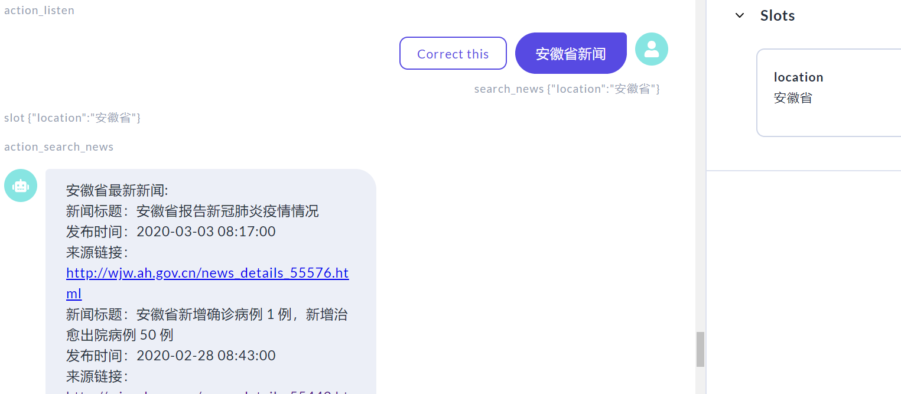

## 疫情查询聊天机器人项目报告


### 目录

[TOC]

### 阅读文档

#### Rasa 

##### Rasa 是什么

Rasa是一个开发人工智能聊天机器人的开源框架。它能根据用户输入的消息，分析用户的意图、从中提取重要的信息保存，并根据设计的对话策略决定要执行的动作，最终输出给用户的回复。

##### Rasa 的结构和工作原理

Rasa主要由两个部分组成，Rasa NLU模块与Rasa core模块，Rasa整体的**工作流程**如图：


*图片来源：https://d33wubrfki0l68.cloudfront.net/7c8474e873bb21965c8a57fe2520adae51164d9d/d6be4/_images/rasa-message-processing.png*

###### **Rasa NLU**

-   Rasa NLU模块负责意图分类、命名实体识别以及选择合适的响应等工作，对应上图中的Interpreter的工作。它是一个独立的模块，在项目中可以单独使用Rasa NLU模块以完成上述的自然语言处理的工作，Rasa 也提供了单独训练Rasa NLU模型和命令行调用Rasa NLU模型的方法。

-   **pipeline**

    Rasa NLU处理用户输入的流程图如下，首先使用分词器分词得到token序列，然后通过特征提取器将token依次向量化，最后进行命名实体识别/意图分类/选择响应等下游工作。

    ```mermaid
    graph TD;
    	A(用户输入)-->B(分词);
        B-->C(特征提取);
        C-->D(命名实体识别);
        C-->E(意图分类);
        C-->F(响应选择);
    	
    ```

    

    Rasa NLU给出了一些预配置的pipeline供开发者直接使用，也支持自由选择Rasa支持的**组件**搭建pipeline，开发者甚至可以自己编写**组件**。

    1.  Rasa支持许多**分词器**，最简单的如WhitespaceTokenizer就是单纯将文本用空白分开，这种分词器和大部分的分词器都是用以处理英文语料的。

        本项目采用的是用于中文文本分词的JiebaTokenizer。**结巴分词**的原理类似HMM，确定一句话中的每个字的标签（标签有词的开头、词中、词的结尾），计算哪种标签序列的概率最大。

        使用结巴分词器时支持在pipeline的配置中指定**自定义词典**。开发者可以在自定义词典中添加一些在聊天机器人处理的语料中常出现的词，为这些词设置较高的词频，以有效提高分词的准确率。本项目使用的[自定义词典](https://github.com/SWYZZWH/nCov_rasa_chatbot/blob/master/jieba_userdict/dic.txt)主要添加了各省和各国名，以及用户输入中的一些常见词如**疫情**、**肺炎**等。

    2.  Rasa同样提供了很多**Featurizer**。根据向量化的结果可以分为两类，分别将token转化为稀疏向量和稠密向量。

        生成稀疏向量的有RegexFeaturizer、CountVectorsFeaturizer、LexicalSyntacticFeaturizer，它们分别基于正则表达式、词袋模型、词法句法分析生成稀疏向量。

        生成稠密向量的Featurizer是利用预训练的词向量来完成token的向量化。MitieFeaturizer和SpacyFeaturizer的原理是提供一个向量词典，为每个token在词典中搜索对应的词向量。

        ConveRTFeaturizer与LanguageModelFeaturizer则使用神经网络模型做word embedding，并提取上下文的特征，在有大规模数据的情况下，后两种特征提取器有更好的准确性，但是相对的训练时间比前两种长。

    3.  Rasa提供了基于Mitie和Sklearn的**意图分类器**，也提供了可以完全自定义神经网络的意图分类器EmbeddingIntentClassifier，该分类器采用监督学习，需要在nlu.md中为每个意图提供大量训练数据。Rasa还提供了一种关键字匹配的意图分类器，这种分类器根据开发者指定的关键词和确信度确定用户意图。

    4.  **命名实体识别**：对中文的支持，MitieEntityExtractor必须要自己构建训练数据的...

        事实上，Rasa支持用户增加**自定义实体**，在本项目中，需要识别的实体为各省、各国家，因此直接在训练数据中手工标注实体，并在domain.yml中注册这些引入的实体。

    5.  **回应选择器**：实质上是一个神经网络模型，当有多个回应备选时，它可以预测出最合适的回复返回给用户


###### **Rasa Core**

Rasa  Core通过stories.md中提供的情景对话数据训练一个模型，这个模型能根据Rasa NLU确定的用户意图、识别的实体、现存的槽、对话历史以及用户制订的策略等，确定聊天机器人下一步应该执行的动作，即如何回应用户的意图。

Rasa  Core的功能主要由Tracker、Policy和Action三个模块实现。

**Tracker**用来记录对话的状态。过程<span style="color:purple;">**2**</span>中，Rasa NLU解析到的信息会传给Tracker。这些信息包括用户当前的意图，涉及到的实体等。聊天机器人针对用户当前的输入执行的动作中会包含产生一系列的事件，如设置或清空某个槽的值，向用户回复消息等。这些事件同样会被Tracker记录下来，这就对应了过程<span style="color:purple;">**5**</span>。Tacker中的数据将会在Policy部分被用到，即过程<span style="color:purple;">**4**</span>。

**Policy**是Rasa Core的中枢，它决定根据用户当前输入以及历史信息，聊天机器人下一步应当执行的动作，开发者需要在`config.yml`中配置一系列的策略，这些策略之间存在优先级。Policy在做决策时，每种策略都会预测一个动作，Policy采纳自信度最高的策略的预测，当多个策略自信程度相近时，结合各策略的优先级综合考虑。

具体来说，Rasa提供了以下几种策略供开发者选择：

1.  **KerasPolicy**：这种策略会利用stories.md中的数据训练一个LSTM（或者用户自定义的模型结构），用以根据用户输入确定执行的动作。具体流程图如下：

    

    *图片来源：https://lh4.googleusercontent.com/mI19oDbOZQGDRTwcMMP3JVPYU3wrFRHPvyyDPqrIvst1DjCR5bPgbIOzzq4QAMKGcD3jjsnW3vn4AJqXhwFpMteeFgkSfcVTylZcMCEiTJFedqtxwlTsVjH2qOEA8WUiReCg6bL-*

2.  **TEDPolicy**：使用Transformer模型，将用户输入、对话历史、槽值、激活的表格等分别做Embedding后输入该Transformer模型，得到用户每次输入后的对话整体状态的Embedding。再将所有动作做Embedding，比较动作的Embedding和对话状态Embedding的相似度，取匹配程度最高的动作。流程图如下：

    

    *图片来源：https://lh4.googleusercontent.com/06bpTndE1JId1jiX-4Hr69_VC4j7OIsQdzsHkOslrhw8QZWnt4bsLc31DEUA3BjwndwYDMtevmDgiuX6NrmhlQqQVLszHeI3o7W7Ku-WpEgPCP9XXIdmu2cUpoCRIuwzkEf6wfe3*

3.  **MappingPolicy**: 上述两种策略是基于神经网络的，也是几乎所有较复杂的聊天机器人都应该配置的策略。MappingPolicy较为简单，就是允许开发者设置某个意图对应唯一的一个动作。当配置了这个策略后，就可以在`domain.yml`中设置意图动作对了。

4.  **MemoizationPolicy**: 这种策略就是简单的记住stories.md中所有对话。当出现了跟训练数据中完全匹配的对话模式时，就按对话的后续确定应该执行的动作。

5.  **AugmentedMemoizationPolicy**: 这种策略是允许Rasa将训练数据中的多个对话拼接组合形成更多更长的对话

6.  **FallbackPolicy**:这是一个非常重要的策略，它决定了聊天机器人在不确定用户的意图或不知道下一步做什么时的处理方法。启用这个策略需要配置三个参数，它们决定了什么时候触发这个策略或者说提供了判断聊天机器人是否困惑的标准，首先，nlu_threshold这个参数确定了当Rasa NLU判断意图的最低自信度，如果低于这个自信度，说明NLU模块无法清楚地判断用户的意图。ambiguity_threshold这个参数是自信度排名第一第二的意图之间自信度的最小差距，如果差距过小，说明NLU在多个意图之间犹豫不决。core_threshold针对的是其他策略确定的下一步要执行的动作，如果Rasa Core对这个动作的自信度低于这个值，那么说明Core不确定下一步应该做什么。一旦上述三个阈值中的任何一个被触发了，Rasa就会默认执行action_default_fallback，开发者可以在domain.yml中直接使用这个动作，指定向用户的输出文本。也可以自定义fallback动作，覆盖默认的fallback动作。

7.  **TwoStageFallbackPolicy**: 这个策略是上一个策略的升级版，它提供了更智能化的Fallback策略。流程图如下：

    ```mermaid
    graph TD;
    	A(用户:原始表述) --无法确定动作--> B(机器人:是否是意图1?);
    	B-->C(用户:是);
    	C-->D(按意图1确定动作);
    	B-->E(用户:否);
    	E--二次确认-->F(机器人:请重述您的意图);
    	F-->G(用户:新表述);
    	G--可以确定动作-->H(执行该动作);
    	G--仍无法确定动作-->I(执行Fallback动作);
    	
    
    ```

    TwoStageFallbackPolicy中有和上一个策略相同的阈值参数，这里的Fallback动作同样可以直接用默认动作，也可以自定义动作覆盖默认动作。与上一个策略不同的时，机器人询问用户的意图以及要求用户重述意图这两个动作都是可以用户自定义的，文档中推荐开发者这样做，能提供更好的用户体验。

    

执行**action**的模块实际上与Rasa框架是分离的，由一个单独的动作服务器实现，所有的用户自定义动作要在这个服务器上注册。这个服务器通过执行`Rasa run actions`启动，在`endpoint.yml`中需要指定这个服务器的终端地址。Policy中决定了要执行的动作后，将信息传递到这个终端地址以执行相应的动作，完成对用户的回应。


#### Rasa X

##### Rasa X是什么

-   Rasa X是Rasa的辅助开发工具。
-   它可以链接github上的Rasa聊天机器人项目
-   提供了前端界面，方便开发者与机器人对话
-   它提供了方便的方式能邀请其他用户使用开发中的机器人。这些用户与机器人的对话数据对于机器人的开发是非常宝贵的

##### 使用Rasa X

Rasa X既可以部署在服务器上，也可以运行在本地，只需要执行

```
Rasa x
```

就能启动Rasa X的界面。在本项目中，仅使用本地的Rasa X以及它自带的聊天界面。


### 实验过程

#### 选题背景

近两个月以来，新型冠状病毒在我国肆虐，截止今天，累计已逾八万人确诊，有近三千人死亡。所有人的生活都受到了严重影响，虽然目前国内形势已有好转，但周边国家以至全世界又在酝酿着新的浪潮。在疫情笼罩下的日子里，我养成了每天看疫情相关信息的习惯。丁香医生提供的疫情信息非常方便，但采用的是信息整合及平台发布的方式。我想能不能结合刚学到的聊天机器人的知识，做一个提供疫情查询的聊天机器人出来，它采用自然语言与用户交互，或许能有独特的应用场景。


#### Api

疫情相关信息并没有直接从丁香园上爬取，一方面因为我并不熟悉爬虫，另一方面因为丁香园面临着海量的访问，使用爬虫浪费服务器资源并不好。

本项目采用[BlankerL](https://github.com/BlankerL)开放的疫情查询api获取数据，该api提供了全国和各地区的疫情整体情况、历史数据、疫情相关的新闻和辟谣等，信息比较**丰富**。每30分钟作者写的爬虫会在丁香园上爬取一次数据，因此信息的**时效性强**。


#### 功能设计

根据api提供的信息，考虑聊天机器人支持以下功能：

-   查询全国整体疫情信息、各省份和其他国家疫情的疫情信息

-   收集疫情的历史信息，作出疫情变化趋势图，并向用户展示

-   展示所有与疫情相关的新闻/展示某地区与疫情相关的新闻

-   展示与疫情相关的谣言与辟谣

    

#### 具体实现步骤

-   **初始化Rasa**

    在项目根目录下命令行输入

    ```
    Rasa init
    ```

    即可获得一个初始化项目，这个初始化项目的文件结构如下：

    这个初始化的聊天机器人主要包括两条逻辑，询问用户的情绪状态，如果情绪不好加以安慰；情绪好则什么都不做。这个聊天机器人为后续开发提供了一个基本框架。

    

-   **搭建pipline**

    本项目使用的pipeline配置如下：

    ```yaml
    pipeline:
      - name: "MitieNLP"
        model: "data/total_word_feature_extractor_zh.dat"
      - name: "JiebaTokenizer"
        dictionary_path: "./jieba_userdict" 
      - name: "MitieEntityExtractor" #可以删掉
      - name: "EntitySynonymMapper" 
      - name: "RegexFeaturizer"
      - name: "MitieFeaturizer"
      - name: "SklearnIntentClassifier"
    ```

    其中，Mitie的预训练词向量数据来源于[GaoQ1](<https://github.com/GaoQ1>)基于中文 wiki 百科训练的数据模型，EntitySynonymMapper组件用来识别同义词。

    

-   **构建实体和插槽**

    命名实体识别可以通过在pipeline中添加组件完成。然而，Rasa官方提供的组件都是针对英文做实体抽取的，如果要添加中文命名实体识别组件则需要自己训练。在本项目中并不需要提取多种类的实体，唯一需要提取的实体是地名。

    首先通过/provinceName的api获取api提供的区域的地名，建立一个结巴分词的用户词典，将所有地名填入，并设置较高的词频，这样能保证地名能被正确分词。再建立一个lookup表，在其中写出所有地名，并在domain.yml中添加location实体。最后，手动设置同义词，在nlu.md中添加synonym标签，并设置每个地名的别名，如：

    ```
    ## synonym: 上海市
    
    -   上海
    
    ## synonym: 新疆维吾尔自治区
    
    -   新疆维吾尔
    -   新疆
    -   维吾尔
    ```

    另外，在nlu.md中其他的意图的训练数据中，如果出现了location实体，需要标出，如：

    ```
    ## intent:search_overall
    ...
    - 我想了解[湖北省](location)的疫情情况
    ```

    为了将用户输入中提取出的location实体可以保存下来，在之后的对话中可以再次使用。考虑设置**插槽**，**插槽**（Slot）相当于聊天机器人的记忆，插槽可以在不同轮的对话中一直保存，并可以被动作和回复随时调用。在domain.yml中定义location插槽，因为插槽名和实体名location相同，当从用户输入里提取出实体时就会自动设置插槽（可以设置关闭自动填充插槽的功能）。

    有**多种类型**的插槽可以选择，包括text型、bool型、整型、浮点型、List型、unfeaturized型等。其他类型的插槽槽值都对模型有影响。只有**unfeaturized类型**的插槽，插槽被设置或没被设置会对模型有影响，而插槽里的值并不会对模型有任何影响。因为用户查询山东省或山西省应当并无不同，所以location插槽选择unfearturized类型。

    在定义插槽时，还可以设置槽的**初始值**，这里可以把location的初始值设为"全国"，这样当用户没有显式输入地点时，将会返回全国的疫情或新闻信息。

    

-   **添加custom action**

    添加自定义action需要在action文件中编写该action的代码，并在domain.yml里注册。

    在action.py里，Rasa提供了一个基本模板

    ```python
    class ActionHelloWorld(Action):
         def name(self) -> Text:
             return "action_hello_world"
    
         def run(self, dispatcher: CollectingDispatcher,
                 tracker: Tracker,
                 domain: Dict[Text, Any]) -> List[Dict[Text, Any]]:
    
             dispatcher.utter_message(text="Hello World!")
             return []
    ```

    所有动作继承自rasa_sdk的Action类，name函数定义了动作名，这个动作名要与domain.yml中注册的动作名相同。run动作是真正执行动作的部分，需要传递dispatcher，tacker，domain三个参数，dispatcher提供了给用户传递信息的接口，tracker中记录着对话的状态，包括用户当前的意图，涉及到的实体、槽值以及历史信息等，在Action中可以使用这些信息。最后domain中记录着在domain.yml中定义的内容，如有哪些actions，哪些slots等。

    为了实现功能设计中的几个功能，需要定义不同的actions。由于查询全国的疫情信息和地区疫情信息获取到的信息格式相同，用户的意图高度重合，因此这两个功能由一个action实现。查询新闻和谣言则用不同的action实现。

    在每个action中，需要访问特定的api获取信息，如查询新闻就要访问/news的api。在访问时还需要提供参数，如查询疫情信息时需要提供地区参数，查询新闻是需要提供返回条数的参数等。

    

-   **作疫情历史趋势图**

    疫情api中除了各地区最新的数据外，还包括全国的历史数据。我考虑获取并利用这些数据作疫情趋势图，这样能使用户非常直观的看到疫情发展的历史情况和趋势。

    从疫情api获取过去14天每天全国新增确诊病例数、新增疑似病例数、累计死亡病例数、累计治愈病例数。使用matplotlib库作疫情趋势图：

    

    

    最初我将作图的代码内置在Action中，即每次触发Action时，要先从api获取历史信息，然后运行作图代码作图，最后从本地加载图片。但这样会导致机器人响应时间过长，用户体验不好，因此改为先做好图，将图片上传到Github上的项目目录。然而在国内会遇到图片加载不出来的情况，最后选择上传到微博图床，可以以相对合理的速度成功向用户展示图片。

    

-   **配置Policy**

  本项目中使用的policies如下：

  ```yaml
  policies:
  - name: MemoizationPolicy
  - name: KerasPolicy
  - name: MappingPolicy
  - name: TwoStageFallbackPolicy
        nlu_threshold: 0.3
        core_threshold: 0.3
  ```

  其中，采用了更复杂的TwoStageFallbackPolicy而不是FallbackPolicy。这是因为在数据量有限的情况下，二次确认用户意图的策略能大大提高机器人**准确**回应用户意图的能力，同时用户也能获得更好的**体验**，而不像使用FallbackPolicy时每次都返回默认的Fallback信息令用户烦躁。

  TwoStageFallbackPolicy中使用了三个默认的Action：要求用户确认意图、要求用户重述意图以及默认回复。其中，默认回复是必须要定义的（Rasa没有默认给出默认回复的功能），它的功能比较简单，当机器人始终不能理解用户的意图时，可能用户的需求在机器人的功能之外了，这时我让机器人提示用户它所有的功能，这只需要在domain中定义`utter_default`函数即可。

  要求用户确认意图和要求用户重述意图并不是必须定义的，只是这两个动作默认的输出是英文的，而且确认意图的按钮直接显示的是intent名，用户根本不理解两个按钮表示什么意思，非常丑陋。因此有必要**重新定义**这两个Action，支持中文，并使其更用户友好。结果展示在最后一部分。

  

-   **创建更多训练数据**

    为了使得NLU模块有更好的表现，需要构造更多NLU训练数据。

    一开始，我想到组合模版和实体的方式来创建更多数据，对nlu.md中的每个意图，我都写了若干个模板，这些模板中的实体是待定的，将所有的实体随机选择一个模板填入，由于实体的数量众多，就构造出了数量相当大的训练数据。Rasa文档中提出可以使用Chatito工具生成训练数据，其原理也基本是排列组合现有语料形成新的语料。

    然而，这种人工合成的数据虽然数量增多了，但因为这些训练数据实际上同质化严重，会造成过拟合。如果用户输入和定义的几个模板非常类似，那么准确率会很高，然而只要与模板有些不同，NLU模块的准确率就会迅速下降。因此我之后按照官方文档中推荐的方法，将所有的实体单独列在lookup表中，并编写更多的模板来提高模型的表现。

    

### 结果展示

本项目的聊天机器人基本满足课程要求，下面集中展示对话结果。


##### 同一个问题多种选择性的回答

这个部分在Rasa中很好实现，只要在responses中同一个utter动作中中添加多个text即可，Rasa的回复选择器会随机选择一个text回复给用户。


##### 提供缺省回答

用户未输入任何地名时，默认查询全国的相关信息，并填充location槽为全国


通过指定TwoStageFallbackPolicy提供，主要包含要求用户确认意图 、要求用户重述意图和默认动作三部分


​																				***要求用户确认意图***


​																				***要求用户重述意图***


​																						***默认动作***


##### 简单查询

插槽已被填入“安徽省”




##### 多轮多次查询


### 参考链接

-   Rasa官方文档：<https://rasa.com/docs/>

-   Rasa官方教程: <https://blog.rasa.com/tag/tutorials/>
-   api文档: <https://lab.isaaclin.cn/nCoV/>
-   中文预训练词向量: <https://github.com/GaoQ1/rasa_chatbot_cn>
-   项目github链接: <https://github.com/SWYZZWH/nCov_rasa_chatbot>